# Introduction

**ASR (Automatic Speech Recognition)** systems transform audio waveforms into text. At the heart of this process lies the **acoustic model** a statistical mapping from audio features to sound units called **phone**.

### What's a Phone

The minimal, perceptually isolable segment of sound the atomic, boundary-defined unit that any hearing system (human or machine) treats as a single entity. From Greek phōnḗ (“sound/voice”), it stays deliberately pre-linguistic, pre-musical, and pre-semantic: the raw quantum from which every audible stream is built, universally accepted in speech tech, music information retrieval, bioacoustics, and forensic audio. Core contemporary representations of the phone (what people actually use in 2025 models)

- **Wavelets** – localized oscillatory atoms; perfect reconstruction + multi-resolution sparsity (denoising, compression, transient capture)
- **Shapelets** – mined discriminative subsequences; shape-focused, highly interpretable for classification
- **MFCCs / Log-Mel frames** – 20–40 ms perceptual coefficients; still the workhorse of legacy and lightweight systems
- **CQ-Transform or Gammatone bins** – constant-Q or auditory-filterbank responses; preferred for music and environmental sound
-   **(Wav2Vec 2.0, HuBERT, Audio-ALiBi, etc.)** – dense vectors learned from raw audio; current state-of-the-art for almost everything
- **Neural codec tokens** (EnCodec, SoundStream, DAC) – discrete 50–1500 Hz tokens; the new standard for generative and ultra-low-bitrate pipelines
- **Sinusoidal + residual tracks** – high-quality parametric modeling for voice conversion and music

From this neutral phone, only three classic domain-specific abstractions emerge:

- **Phoneme** – bundle of phones that are contrastive in a given language
- **Grapheme** – written symbol(s) conventionally linked to a phoneme
- **Note** – phone whose dominant attribute is stable perceived pitch (musical domain)

---

## 0. Digital Signal Processing Foundations Recap

These operations are covered in detail in previous posts. Here's the quick reference for speech processing:

**Convolution** $(x * h)[n]$

  how filters and systems transform signals. Convolution in time = multiplication in frequency (FFT Fast Fourier Transform speedup).

**Correlation** $R_{xx}[n]$

  measures self-similarity at different lags. Peaks in autocorrelation reveal pitch period.

**DFT (Discrete Fourier Transform)** $X[k] = \sum_n x[n] e^{-i2\pi kn/N}$

  decomposes signal into frequency components. Magnitude = "how much", phase = "when".

**Windowing**

  When we extract a finite frame from a continuous signal, the abrupt edges create artificial discontinuities. The DFT assumes periodicity, so these sharp cuts cause **spectral leakage** energy spreading into adjacent frequency bins where it shouldn't be.

A window function tapers the frame smoothly to zero at the edges:

| Window      | Main Lobe Width | Side Lobe Level  | Use Case                     |
| ----------- | --------------- | ---------------- | ---------------------------- |
| Rectangular | Narrowest       | Highest (-13 dB) | Maximum frequency resolution |
| Hamming     | Medium          | Low (-43 dB)     | General speech analysis      |
| Hann        | Medium          | Lower (-31 dB)   | Spectral analysis            |
| Blackman    | Widest          | Lowest (-58 dB)  | When leakage must be minimal |

**Trade-off:** Narrower main lobe = better frequency resolution. Lower side lobes = less leakage. You can't optimize both this is the **time-frequency uncertainty principle**.

> For speech processing, **Hamming window** is the standard choice: good balance between frequency resolution and leakage suppression.
{: .prompt-tip }

**STFT (Short-Time Fourier Transform)** $X[m,k]$   sliding window DFT producing spectrograms. For speech: 20-30ms frames, 10ms hop. Time-frequency uncertainty: $\Delta t \cdot \Delta f \geq 1/4\pi$.

---

## 1. Filtering - Frequency Selection

With these foundational operations established, we can now build speech processing systems. The first step is often **filtering**: selectively passing or blocking certain frequencies to prepare the signal for analysis. Frequency notation can be $\omega$ or $f$ or $\nu$.

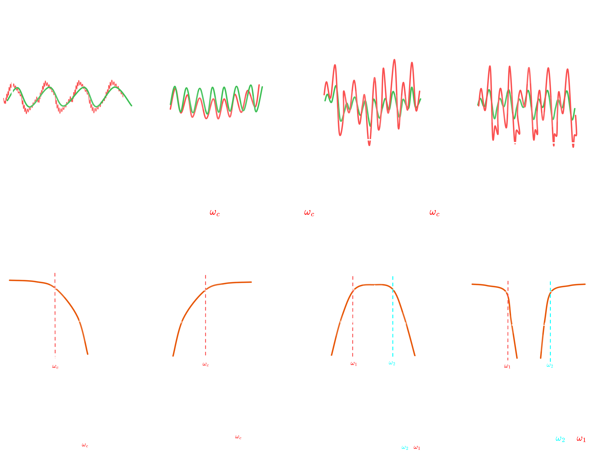{: .dark }

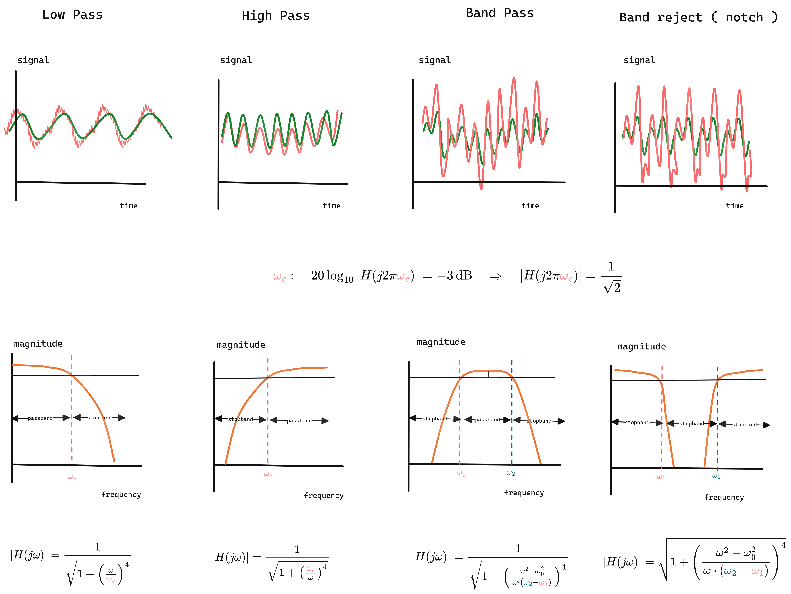{: .light }
_Figure 1.0:Effect of Classical Filters on Signals in Time and Frequency Domains_

### 1.1 Filter Types by Frequency Response

Filters are categorized by which frequencies they allow through:

| Type      | Passes                 | Blocks          | Use Case                                                                                                                 |
| --------- | ---------------------- | --------------- | ------------------------------------------------------------------------------------------------------------------------ |
| Low-pass  | $f < f_c$              | $f > f_c$       | Attenuates high frequencies; used to reduce hiss, emphasize bass, or prevent aliasing in digital audio recording.        |
| High-pass | $f > f_c$              | $f < f_c$       | Attenuates low frequencies; used to remove rumble, DC offset, or low-end noise in microphones and mixers.                |
| Band-pass | $f_1 < f < f_2$        | else            | Passes a specific frequency range; used in equalizers, crossovers, or to isolate instruments/vocals in audio production. |
| Band-stop | $f < f_1$ or $f > f_2$ | $f_1 < f < f_2$ | Rejects a specific frequency range; used to eliminate hum, feedback, or unwanted resonances in sound systems.            |

### 1.2 Filter Design: Magnitude Response Characteristics

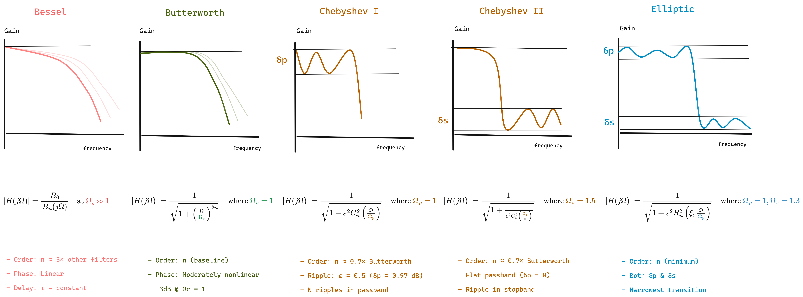{: .light}

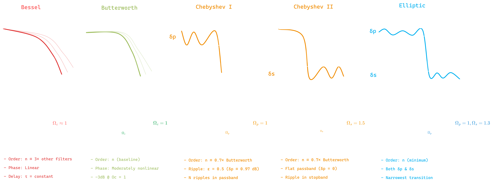{: .dark }
_Figure 1.1: Filter Design types_

While the filter type determines **which frequencies** to pass or block, the **filter design** determines **how** this transition occurs. Different filter approximations offer trade-offs between passband flatness, stopband attenuation, transition sharpness, and phase response.

The magnitude response $|H(j\omega)|$ characterizes how a filter attenuates signals at different frequencies. Key design considerations include:

- **Passband ripple**: Oscillations in the passband (ideally zero)
- **Stopband ripple**: Oscillations in the stopband
- **Transition bandwidth**: Width of the transition between passband and stopband
- **Rolloff rate**: How quickly attenuation increases in the transition band

| Type         | Passband | Stopband | Transition | Use Case                                                                                                    |
| ------------ | -------- | -------- | ---------- | ----------------------------------------------------------------------------------------------------------- |
| Butterworth  | Flat     | Flat     | Moderate   | Maximally flat response; used when minimal distortion and good phase response are critical.                 |
| Bessel       | Flat     | Flat     | Slow       | Linear phase and constant group delay; used when preserving waveform shape is critical (pulse/audio).       |
| Chebyshev I  | Ripple   | Flat     | Sharp      | Accepts passband ripple for sharper rolloff; used when steep cutoff is needed with good stopband rejection. |
| Chebyshev II | Flat     | Ripple   | Sharp      | Maintains flat passband with stopband ripple; used when pristine passband quality is essential.             |
| Elliptic     | Ripple   | Ripple   | Sharpest   | Trades ripples in both bands for minimal transition width; used when filter order must be minimized.        |

> **Notation Guide**
>
> **$\Omega$ (Omega):** Normalized frequency = $\omega/\omega_c$ (dimensionless ratio)
>
> **$\varepsilon$ (Epsilon):** Ripple factor controlling passband/stopband ripple amplitude $$\varepsilon = \sqrt{10^{R_p/10} - 1}$$ where $R_p$ is passband ripple in dB. Example: $\varepsilon = 0.5 \Rightarrow R_p \approx 0.97$ dB
>
> **$B_n(s)$:** Reverse Bessel polynomial of order $n$ $$B_n(s) = \sum_{k=0}^{n} \frac{(2n-k)!}{2^{n-k} \cdot k! \cdot (n-k)!} s^k$$ Examples: $B_1(s) = s+1$, $B_3(s) = s^3 + 6s^2 + 15s + 15$
> 📖 [Wikipedia: Bessel Filter](https://en.wikipedia.org/wiki/Bessel_filter) | [Bessel Polynomials](https://en.wikipedia.org/wiki/Bessel_polynomials)
>
> **$C_n(x)$:** Chebyshev polynomial of the first kind $$C_n(x) = \begin{cases} \cos(n \arccos x) & |x| \leq 1 \ \cosh(n \text{ arccosh } x) & |x| > 1 \end{cases}$$ Examples:
> $C_0(x) = 1$, $C_1(x) = x$, $C_2(x) = 2x^2-1$, $C_3(x) = 4x^3-3x$
> 📖 [Wikipedia: Chebyshev Polynomials](https://en.wikipedia.org/wiki/Chebyshev_polynomials)
>
> **$R_n(\xi, x)$:** Jacobian elliptic rational function (order $n$, selectivity $\xi$)
>
> - Alternates between 0 and ±1, creating equiripple in both bands
> - $\xi$ controls transition sharpness
> - 📖 [Wikipedia: Jacobian Elliptic Functions](https://en.wikipedia.org/wiki/Jacobi_elliptic_functions)
{: .prompt-info }

### 1.3 Digital Filter Implementations

Digital filters are fundamentally distinguished by their use of feedback in the difference equation.

#### Non-Recursive Filters (FIR)

A **non-recursive filter** computes output using only current and past inputs no feedback loop.

$$y[n] = \sum_{k=0}^{M} b_k \cdot x[n-k]$$

**Intuition:** Output is a weighted sum of the current and past $M$ input samples only. If you feed an impulse (single spike), the output dies after $M$ samples hence "finite impulse response."

| Property            | Explanation                                    |
| ------------------- | ---------------------------------------------- |
| Always stable       | No feedback → no risk of runaway oscillation   |
| Linear phase        | Symmetric coefficients preserve waveform shape |
| Higher order needed | Need many taps for sharp cutoffs               |

#### Recursive Filters (IIR)

A **recursive filter** incorporates feedback output depends on past outputs as well as inputs.

$$y[n] = \sum_{k=0}^{M} b_k \cdot x[n-k] - \sum_{k=1}^{N} a_k \cdot y[n-k]$$

**Intuition:** Output depends on past inputs AND past outputs (feedback). An impulse can theoretically ring forever hence "infinite impulse response." The feedback creates resonances that achieve sharp frequency responses with fewer coefficients.

| Property         | Explanation                                                                   |
| ---------------- | ----------------------------------------------------------------------------- |
| Can be unstable  | Feedback can cause output to explode if poles outside unit circle             |
| Lower order      | Feedback provides "free" filtering; 2nd-order IIR ≈ 50th-order FIR            |
| Phase distortion | Different frequencies delayed differently (problematic for some applications) |

> Recursive filters can become unstable if not designed carefully. Always verify that all poles are inside the unit circle in the z-plane.
> {: .prompt-warning }

**In speech processing:**

- **Non-recursive (FIR):** Mel filterbanks (linear phase preserves temporal structure)
- **Recursive (IIR):** Pre-emphasis (simple 1st-order, low latency)

#### Pre-emphasis Filter


$$y[n] = x[n] - \alpha x[n-1], \quad \alpha \approx 0.97$$

**Transfer function:** $H(z) = 1 - \alpha z^{-1}$

**Frequency response:** $\lvert H(e^{i\omega}) \rvert = \sqrt{1 + \alpha^2 - 2\alpha\cos\omega}$

Boosts high frequencies ~6 dB/octave.

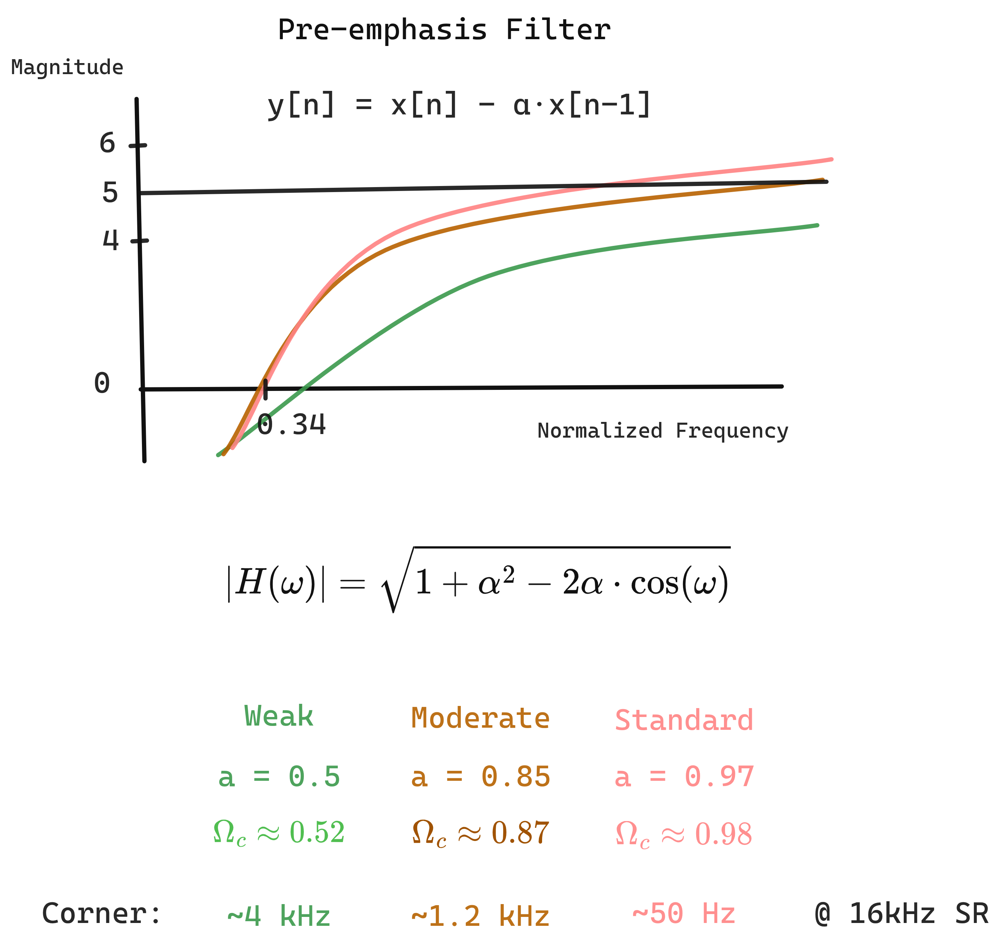
{: .light}

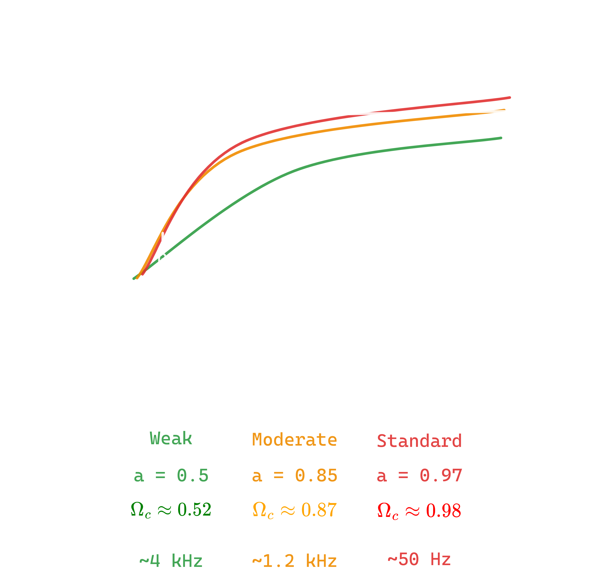{: .dark }
_Figure 1.2:  Pre-Emphasis Filter Design types_

#### Why Pre-emphasis?

The glottal source (vocal cord vibration) has a natural spectral tilt: energy decreases ~20 dB/decade at higher frequencies. Pre-emphasis compensates for this, giving high-frequency formants more weight in analysis. Without it, low frequencies would dominate MFCC computation.

### 1.4 Common Filter Artifacts and Phenomena

| Artifact         | Cause                                    | Manifestation                            | Mitigation                                                                 |
| ---------------- | ---------------------------------------- | ---------------------------------------- | -------------------------------------------------------------------------- |
| Gibbs Phenomenon | Brick-wall ideal filters (discontinuity) | ~9% overshoot, persistent ringing        | Use realizable filters with gradual transitions; apply window functions.   |
| Ringing          | Sharp cutoff filters                     | Temporal oscillations near transients    | Lower filter order; use Butterworth over Chebyshev/Elliptic.               |
| Passband Ripple  | Chebyshev I, Elliptic designs            | Amplitude variations in passband         | Use Butterworth or Chebyshev II if flat passband is critical.              |
| Stopband Ripple  | Chebyshev II, Elliptic designs           | Incomplete attenuation in stopband       | Increase filter order or use Butterworth/Chebyshev I for better rejection. |
| Phase Distortion | Recursive filters (non-linear phase)     | Frequency components delayed differently | Use non-recursive filters for linear phase; minimize with Butterworth.     |
| Pre-ringing      | Non-causal or symmetric non-recursive    | Oscillations before transient            | Accept for offline processing; use minimum-phase designs for real-time.    |

---

## 2. Cepstral Analysis

Now that we can filter and shape the spectrum, we need a way to **separate** the two main components of speech: the excitation source (vocal cords) and the vocal tract filter. The cepstrum provides exactly this capability.

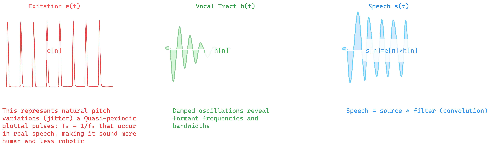
{: .dark }
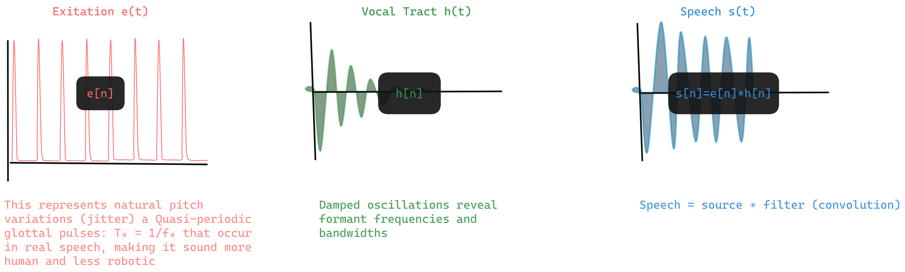{: .light }
_Figure 2.0: Cepstrum separating source and filter in time domain_


 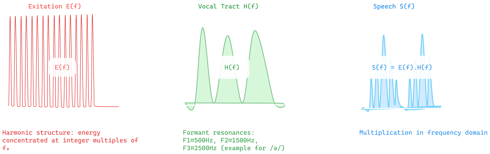{: .dark } 
 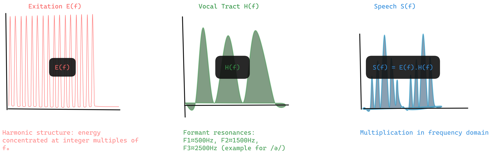{: .light } 
_Figure 2.1: Cepstrum separating source and filter in frequency domain_


### Homomorphic Deconvolution

Speech = source _ filter: $s[n] = e[n] _ h[n]$

In frequency: $S(f) = E(f) \cdot H(f)$

Take log: $\log S = \log E + \log H$

**Cepstrum:** inverse DFT of log magnitude spectrum

$$c[n] = \mathcal{F}^{-1}\{\log \lvert X[k] \rvert\}$$

### Quefrency Domain

**Quefrency** is the independent variable in the cepstral domain it has units of time (samples or milliseconds) but represents "rate of change in the spectrum." The name is an anagram of "frequency," following the cepstrum/spectrum wordplay.

- Low quefrency: slow spectral variations (vocal tract = formants)
- High quefrency: fast spectral variations (pitch harmonics)

### Liftering

Keep only low-quefrency components:

$$\hat{c}[n] = c[n] \cdot l[n]$$

where $l[n]$ is a low-pass lifter.


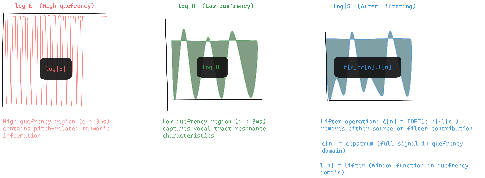{: .light } 
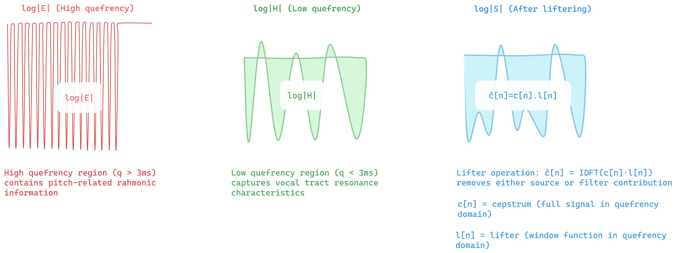{: .dark } 
_Figure 2.1: Cepstrum separating source and filter in quefrency domain_

### Cepstrum Intuition

**Etymology:** "Cepstrum" is an anagram of "spectrum" we're analyzing the spectrum of a spectrum.

**Separation principle:** The vocal tract (slow-varying formants) appears at low quefrencies. The pitch harmonics (fast-varying) appear at high quefrencies. Liftering removes pitch, leaving vocal tract shape the basis for speaker-independent recognition.

**Connection to MFCCs:** MFCCs are essentially cepstral coefficients computed on a mel-warped spectrum. The DCT decorrelates the log mel energies, producing a compact representation of the spectral envelope.

---

## 3. Discrete Cosine Transform (DCT)

Before introducing mel-frequency processing, we first define the transform that will ultimately produce the cepstral coefficients. MFCCs are _defined_ as the DCT of log-mel energies, so the DCT must be understood first.

The **Discrete Cosine Transform (DCT)** is a real-valued orthogonal transform closely related to the Fourier transform, but using only cosine basis functions. Its key role is to decorrelate inputs and compact energy into a small number of coefficients.

### Definition (DCT-II)

$$  
C[k] = \sum_{n=0}^{N-1} x[n]\cos\left(\frac{\pi k(2n+1)}{2N}\right)  
$$

### Why the DCT Is Used

- **Energy compaction:** Most signal energy concentrates in the first few coefficients
- **Decorrelation:** Approximates the Karhunen–Loève Transform for short-term speech spectra
- **Real-valued output:** No complex arithmetic

These properties make the DCT ideal for transforming correlated spectral energies into a compact statistical representation.

|Property|DFT|DCT|
|---|---|---|
|Output|Complex|Real|
|Boundary|Periodic|Symmetric extension|
|Compaction|Good|Better|

---

## 4. Mel-Frequency Analysis

The cepstrum operates on **linear frequency**, but human hearing does not. To align spectral analysis with perception, frequencies are first warped to the **mel scale**, producing **Mel-Frequency Cepstral Coefficients (MFCCs)** after DCT.

### The Origin of "Mel"

The term _mel_ (from _melody_) was introduced by Stevens, Volkmann, and Newman (1937) during early studies of pitch perception.

### Why We Need the Mel Scale

Human auditory resolution is high at low frequencies and coarse at high frequencies:

- **100 Hz → 200 Hz** sounds like a large jump
- **5000 Hz → 5100 Hz** sounds negligible
    
This motivates a nonlinear frequency axis that expands low frequencies and compresses high ones.

### Mel Scale Formulas

Forward mapping (Hz → mel):
$$  
m = 2595 \log_{10}\left(1 + \frac{f}{700}\right)  
$$
or equivalently,
$$  
m = 1127 \ln\left(1 + \frac{f}{700}\right)  
$$
Inverse mapping (mel → Hz):
$$  
f = 700\left(10^{\frac{m}{2595}} - 1\right)  
$$
or
$$  
f = 700\left(e^{\frac{m}{1127}} - 1\right)  
$$
Equal mel intervals correspond to equal perceived pitch intervals.


{: .dark } {: .light } 
_Figure 3.0: The Mel Scale: Modeling Human Hearing_

---

### Mel Filterbank

Triangular filters are uniformly spaced in the **mel domain**, not in Hz. Each filter (H_m[k]) spans three adjacent mel-spaced frequency points:

$$  
H_m[k] =  
\begin{cases}  
0 & k < f[m-1] \\  
\frac{k - f[m-1]}{f[m] - f[m-1]} & f[m-1] \le k < f[m] \\  
\frac{f[m+1] - k}{f[m+1] - f[m]} & f[m] \le k < f[m+1] \\ 
0 & k \ge f[m+1]  
\end{cases}  
$$

---

### Filterbank Energies

Applying the mel filters to the power spectrum produces mel-band energies:
$$  
E_m = \sum_{k=0}^{N/2} |X[k]|^2 \cdot H_m[k]  
$$
These energies are perceptually meaningful but highly correlated.


### MFCC Computation

Log compression models loudness perception:

$$  
\tilde{E}_m = \log E_m  
$$

Finally, MFCCs are obtained by applying the DCT:

$$  
c_i =  
\sum_{m=1}^{M}  
\tilde{E}_m  
\cos\left(  
\frac{\pi i(m - 0.5)}{M}  
\right)  
$$

Thus, **MFCCs are the DCT of log-mel filterbank energies**.

---

### Dynamic Features

Delta and delta-delta coefficients capture temporal dynamics:

$$  
\Delta c_t =  
\frac{  
\sum_{n=1}^{N} n(c_{t+n} - c_{t-n})  
}{  
2\sum_{n=1}^{N} n^2  
}  
$$

Standard feature vector: **39 dimensions**

- 13 static MFCCs
- 13 deltas    
- 13 delta-deltas

#### MFCC Processing Pipeline

Let (x[n]) be a real-valued, finite-length speech frame of length (N), windowed in time.


**Short-Time Fourier Transform (STFT)**  
The discrete Fourier transform maps the signal from time to linear frequency:
$$  
X[k] = \sum_{n=0}^{N-1} x[n],e^{-j\frac{2\pi}{N}kn},  
\qquad k = 0,\dots,N-1  
$$

**Power Spectrum Operator**  
Phase information is discarded and spectral energy is retained:
$$  
P[k] = |X[k]|^2  
$$

**Mel Filterbank Projection**  
Let ({H_m[k]}_{m=1}^M) be mel-spaced triangular filters forming a non-uniform spectral partition.  
Each filter performs a weighted inner product with the power spectrum:

$$  
E_m = \sum_{k=0}^{N/2} P[k],H_m[k],  
\qquad m = 1,\dots,M  
$$

This defines a mapping  
 -
$$\mathbb{R}^{N/2+1} \rightarrow \mathbb{R}^M$$
from linear-frequency energy to perceptual frequency energy.

**Logarithmic Nonlinearity**  
Dynamic range compression and loudness modeling are applied component-wise:
$$  
\tilde{E}_m = \log(E_m)  
$$
This converts multiplicative spectral variations into additive ones.

**Discrete Cosine Transform (Cepstral Projection)**  
The DCT applies an orthogonal change of basis to decorrelate mel-band energies:

$$  
c_i =  
\sum_{m=1}^{M}  
\tilde{E}_m  
\cos!\left(  
\frac{\pi i (m - \tfrac12)}{M}  
\right),  
\qquad i = 0,\dots,L-1  
$$

This operation maps the log-mel spectrum into the **cepstral domain**, concentrating information into low-order coefficients.

#### MFCC Mapping (Operator Form)

The complete MFCC extraction process can therefore be written as the composition:

$$  
\boxed{  
\mathbf{c}
=
\mathcal{D}  
\circ  
\log  
\circ  
\mathcal{H}  
\circ  
|\mathcal{F}|  
,(x[n])  
}  
$$
where:

- $\mathcal{F}$: Fourier transform
- $|\cdot|$: magnitude-squared (power spectrum)
- $\mathcal{H}$: mel filterbank projection
- $\log$: logarithmic compression
- $\mathcal{D}$: discrete cosine transform
    
The operator $\mathcal{H}$ in the MFCC mapping represents a linear projection from the power spectrum to mel-band energies. This operator is defined by a set of overlapping weighting functions constructed via uniform sampling in the mel domain. The figure below visualizes this projection by showing the triangular responses that constitute the mel filterbank.

{: .dark } {: .light } 
_Figure 3.1: The Mel Scale: Modeling Human Hearing_

Each triangle corresponds to one row of the operator $\mathcal{H}$ and defines how spectral energy is aggregated within a frequency band. This projection produces the log-mel energies that are subsequently decorrelated by the discrete cosine transform $\mathcal{D}$ to form MFCCs, linking the Fourier domain to the cepstral representation


In voice analysis tasks such as **formant stability assessment** or **vocal tract configuration estimation**, small variations in articulation cause continuous shifts in spectral peaks rather than discrete changes. Hard band assignment would convert these continuous shifts into discontinuous feature variations, degrading measurement reliability. 

Triangular mel filters preserve continuity by linearly sharing energy between neighboring bands, producing stable spectral descriptors under normal intra-speaker variation. This makes them suitable for voice-based analysis where consistency across repeated phonation is required.


---

## 5. Linear Prediction (LPC)


Speech signals, when sampled at typical rates of 8-16 kHz, generate substantial amounts of dataapproximately 480,000 samples per minute at 8 kHz. This presents significant challenges for transmission and storage in telecommunications and audio processing systems. Linear Predictive Coding (LPC) addresses this challenge by exploiting the inherent structure and predictability of speech signals to achieve efficient parametric representations using only 10-20 coefficients per analysis frame.

Unlike MFCCs which capture spectral shape through filterbanks, LPC models the speech production mechanism itself, representing the vocal tract as an all-pole filter. This approach proves particularly effective for speech coding, synthesis, and formant analysis.
#### The Prediction Framework

The fundamental observation underlying LPC is that speech exhibits strong short-term correlation consecutive samples are not independent but related through the physical constraints of vocal tract resonance. This correlation structure can be exploited for compression and analysis.

**The prediction model** expresses the current sample as a linear combination of $p$ previous samples: $$\hat{s}[n] = \sum_{k=1}^{p} \alpha_k \cdot s[n-k]$$The **prediction error** quantifies how well this model captures the signal: $$e[n] = s[n] - \hat{s}[n] = s[n] - \sum_{k=1}^{p} \alpha_k \cdot s[n-k]$$When prediction is accurate (small error), the signal structure is well-captured by the coefficients $\alpha_k$. These coefficients, rather than the raw samples, can then be transmitted or stored, achieving substantial data reduction.

#### The Source-Filter Model

To understand what these prediction coefficients represent physically, we consider the source-filter theory of speech production. The vocal tract acts as a resonant cavity, filtering an excitation source (either periodic glottal pulses for voiced sounds or turbulent noise for unvoiced sounds).

LPC models this system through an all-pole transfer function: $$H(z) = \frac{G}{1 + \sum_{k=1}^{p} \alpha_k z^{-k}} = \frac{G}{A(z)}$$
where $G$ represents the gain and $A(z)$ is the inverse filter. The poles of $H(z)$ correspond directly to the **formants** the resonant frequencies of the vocal tract that determine vowel identity and other phonetic characteristics. This physical correspondence explains why LPC proves so effective for speech: the mathematical model aligns with the underlying acoustic production mechanism.
#### Coefficient Estimation via Error Minimization

Having established the prediction framework, we must determine the optimal coefficients $\alpha_k$. The standard approach minimizes the total squared prediction error over an analysis window:
$$E = \sum_{n} e^2[n] = \sum_{n} \left(s[n] - \sum_{k=1}^{p} \alpha_k s[n-k]\right)^2$$
Applying calculus optimization (setting partial derivatives to zero) yields the **normal equations**:
$$\sum_{k=1}^{p} \alpha_k \phi(i,k) = \phi(i,0), \quad i = 1, \ldots, p$$
where $\phi(i,k) = \sum_n s[n-i]s[n-k]$ represent correlation terms between time-shifted versions of the signal.

These equations, known as the **Yule-Walker equations**, form a system of $p$ linear equations in $p$ unknowns. While standard matrix inversion could solve this system, the computational cost of $O(p^3)$ operations becomes prohibitive for real-time processing, particularly when analyzing speech frame-by-frame.

<iframe width="560" height="315" src="https://www.youtube.com/watch?v=1230arWETzY" title="YouTube video player" frameborder="0" allow="accelerometer; autoplay; clipboard-write; encrypted-media; gyroscope; picture-in-picture" allowfullscreen></iframe>
#### Efficient Solution: Levinson-Durbin Algorithm

The correlation matrix arising from the autocorrelation method possesses a special Toeplitz structure (constant values along diagonals). The Levinson-Durbin algorithm exploits this structure to reduce computational complexity from $O(p^3)$ to $O(p^2)$, making real-time LPC analysis feasible.

**The algorithm builds solutions recursively,** computing the optimal $i$-th order predictor from the $(i-1)$-th order solution:

**Initialize:** $$E^{(0)} = R[0]$$

**For each order $i = 1, 2, \ldots, p$:**

1. **Compute reflection coefficient (PARCOR):** $$k_i = \frac{R[i] - \sum_{j=1}^{i-1} \alpha_j^{(i-1)} R[i-j]}{E^{(i-1)}}$$
2. **Update coefficients:** $$\alpha_i^{(i)} = k_i$$$\alpha_j^{(i)} = \alpha_j^{(i-1)} - k_i \cdot \alpha_{i-j}^{(i-1)}, \quad j = 1, \ldots, i-1$$
    
3. **Update prediction error:** $$E^{(i)} = (1 - k_i^2) E^{(i-1)}$$

**Properties of note:**

- The reflection coefficients $k_i$ correspond to acoustic reflections in tube models of the vocal tract
- When $|k_i| < 1$ for all $i$, filter stability is guaranteed (minimum phase property)
- This condition is automatically satisfied for valid autocorrelation sequences
- Prediction error decreases monotonically with model order
#### Implementation Methods

Two primary approaches exist for formulating the correlation matrices, each with distinct trade-offs:

##### Autocorrelation Method

This approach applies a window function (typically Hamming) before computing autocorrelation:

1. Window the signal: $\hat{s}[m] = s[m+n] \cdot w[m]$
2. Compute autocorrelation: $R[k] = \sum_{m=0}^{L-1} \hat{s}[m]\hat{s}[m+k]$
3. Solve via Levinson-Durbin

| Advantages                                          | Limitations                                      |
| --------------------------------------------------- | ------------------------------------------------ |
| Always produces **stable (minimum-phase) filters**  | **Windowing introduces edge effects**            |
| Efficient **($O(p^2)$)** solution (Levinson–Durbin) | Boundary prediction uses **zero-padded samples** |
| Preserves **autocorrelation matching**              | Requires **careful window selection**            |

##### Covariance Method

This method avoids windowing by extending the analysis region to include valid samples before the current frame:

1. Analyze fixed interval $[0, L-1]$ without windowing
2. Use samples from extended region $[-p, L-1]$
3. Solve via Cholesky decomposition (matrix is symmetric but not Toeplitz)

| Advantages                          | Limitations                        |
| ----------------------------------- | ---------------------------------- |
| **No windowing artifacts**          | **Stability not guaranteed**       |
| Uses **only actual speech samples** | Higher complexity **$(O(p^3))$**   |
| Better **spectral matching**        | More **computationally expensive** |


#### Model Gain and Spectral Properties

The gain parameter $G$ is determined by matching signal energy:

$$G^2 = E^{(p)} = R[0] - \sum_{k=1}^{p} \alpha_k R[k]$$

This represents the residual energy after optimal $p$-th order prediction.

**Spectral interpretation** provides insight into what LPC captures. The LPC spectrum is:

$$|H(e^{j\omega})|^2 = \frac{G^2}{|A(e^{j\omega})|^2} = \frac{G^2}{\left|1 + \sum_{k=1}^{p} \alpha_k e^{-j\omega k}\right|^2}$$

In frequency domain terms, minimizing prediction error is equivalent to:

$$E = \frac{1}{2\pi}\int_{-\pi}^{\pi} \frac{|S(e^{j\omega})|^2}{|H(e^{j\omega})|^2} d\omega$$

This formulation reveals a key property: **LPC weights frequencies where signal energy is concentrated more heavily.** Consequently, LPC excels at matching spectral peaks (formants) while smoothing spectral valleys. This behavior aligns naturally with perceptual importance formants carry most phonetic information, while fine spectral details matter less for intelligibility.

This frequency-weighting characteristic explains why LPC proves particularly effective for speech: it automatically emphasizes the perceptually relevant features while efficiently representing less critical aspects of the spectrum.

#### Applications and Summary

LPC finds widespread application in telecommunications (voice codecs like G.729), speech synthesis systems, voice morphing, and clinical speech analysis. The technique's success stems from its alignment with speech production mechanisms the all-pole model captures vocal tract resonances that determine phonetic identity, while the efficient parametric representation enables substantial compression with minimal quality loss.

The choice of model order $p$ typically ranges from 8-16 depending on sampling rate and application requirements, balancing spectral resolution against computational cost and parameter overhead.

---

## 6. Fundamental Frequency (F0) Estimation

So far we've focused on the vocal tract (formants, spectral envelope). But the other critical component is the **excitation source** specifically, the fundamental frequency or pitch.

**F0 (Fundamental Frequency)** is the rate at which the vocal cords vibrate during voiced speech it determines the perceived pitch. F0 carries prosodic information: intonation, stress, emotion. Estimating it reliably is essential for many applications.

<!-- {: .dark } -->
<!-- {: .light } -->

_Figure 6.0: Pitch detection methods_

#### **Autocorrelation Method**

**Definition**

The **autocorrelation method** estimates the fundamental frequency (F₀) by measuring the similarity of the signal with delayed versions of itself. Peaks in the autocorrelation indicate repeated patterns, corresponding to the pitch period.

**Core equation**

$$R[k] = \sum_{n} x[n] \cdot x[n+k]$$
* (x[n]) is the discrete speech signal.
* (k) is the lag (delay) in samples.
* (R[k]) is the autocorrelation at lag (k).

**Pitch calculation**

1. Identify the **first major peak** after ($R[0]$) → this gives the **pitch period** ($T_0$).
2. Convert to F₀:
$$F_0 = \frac{f_s}{T_0}$$
where (f_s) is the sampling frequency.

**Key points**

* Time-domain method    simple and intuitive.
* Works best for **clean, voiced speech**.
* Peaks correspond to **repetition rate of vocal fold vibrations**.

**Remark**

* Susceptible to **octave errors** (misidentifying double/half pitch).
* Noise and aperiodic speech can **blur peaks**, reducing accuracy.


### **Cepstral Method**

**Definition**

The **cepstral method** estimates F₀ by transforming the speech signal to a “quefrency” domain (via logarithm of the spectrum and inverse Fourier transform). Peaks in this domain correspond to periodicity in the time signal    effectively the pitch period.

**Core equations**

1. Compute the **spectrum** of the signal: $X(f) = \mathcal{F}{x[n]}$
2. Take the **log magnitude**: $\log|X(f)|$
3. Apply **inverse Fourier transform** to get the **cepstrum**: $c[n] = \mathcal{F}^{-1}{\log|X(f)|}$
4. Find **peak in cepstrum** at quefrency (T_0) → corresponds to the **pitch period**.
5. Convert to F₀: $F_0 = \frac{f_s}{T_0}$

**Key points**

* Frequency-domain method (indirectly time-domain).
* Separates **source (F₀)** from **filter (vocal tract)** effects.
* More robust to **spectral variations and noise** than simple autocorrelation.

**Remark**

* Can handle **mildly noisy or complex speech** better.
* Requires **FFT and log operation**, slightly more computationally expensive.
* Less intuitive than autocorrelation but often more reliable in practice.

In real-world speech, periodicity is neither clean nor stationary, creating ambiguity in the fundamental frequency. This has motivated multiple complementary strategies for F₀ estimation  most notably RAPT, YAAPT, and DIO  each exploiting different representations of the speech signal.
#### **RAPT (Robust Algorithm for Pitch Tracking)**

**Definition**  
RAPT estimates the fundamental frequency (F_0) by maximizing **normalized autocorrelation** over candidate lags and enforcing **temporal continuity** via dynamic programming.

**Core equation (normalized autocorrelation)**  

$$r(\tau) = \frac{\sum_{n} x(n),x(n+\tau)}  
{\sqrt{\sum_{n} x^2(n)\sum_{n} x^2(n+\tau)}}$$

**Key points**

- Time-domain method
- Pitch candidates selected from autocorrelation peaks
- Dynamic programming minimizes frame-to-frame pitch jumps
- Explicit voiced/unvoiced decision via correlation threshold

**Remark**

- Stable and well-understood, but **octave errors** may appear when higher harmonics dominate or SNR is low.
    
#### **YAAPT (Yet Another Algorithm for Pitch Tracking)**

**Definition**  
YAAPT estimates (F_0) by **combining time-domain autocorrelation with frequency-domain spectral cues**, improving robustness in noisy and expressive speech.

**Core idea (multi-domain fusion)**  

$$F_0 = \arg\max_f \left( w_t,C_{\text{time}}(f) + w_f,C_{\text{freq}}(f) \right)$$

**Key points**

- Hybrid time–frequency approach
- Uses spectral peaks and energy-based voicing decisions
- Strong voiced/unvoiced classification
- Dynamic programming for pitch continuity

**Remark**
- More robust than RAPT, with **reduced octave errors**, at the cost of higher computational complexity.

#### **DIO (Distributed Inline-filter Operation – WORLD)**

**Definition**

DIO estimates (F_0) by generating multiple candidates from **spectral envelope and zero-crossing information**, optimized for **high-speed and high-quality vocoding**.

**Core idea (candidate aggregation)**  
$$
F_0(t) = \operatorname{median}\left\{ F_0^{(i)}(t) \right\}_{i=1}^{N}
$$

**Key points**

- Frequency-domain driven
- Multiple band-wise F0 candidates
- Accurate voiced/unvoiced boundary detection
- Often refined using **StoneMask**

**Remark**

- Very low octave error rate and excellent temporal stability; **standard in modern TTS and voice conversion**.

### Typical Ranges

- Male: 80-200 Hz
- Female: 150-350 Hz
- Child: 200-500 Hz

---

## 7. Modulation and Demodulation

Speech can be viewed as a slowly-varying envelope (amplitude modulation) riding on rapidly-varying carriers (formants). Extracting these modulations provides yet another perspective on the signal one that connects to neural processing of speech and alternative feature representations.


<div style="text-align: center;">
  <figure>
    
  </figure>
</div>
_Figure 7.0: AM, FM, and the analytic signal_

### Amplitude Modulation

$$y(t) = x(t) \cdot \cos(2\pi f_c t)$$

Envelope: $\lvert x(t) \rvert$

### Hilbert Transform and Analytic Signal


<iframe width="560" height="315" src="https://www.youtube.com/watch?v=_dBNed8D3WY" title="YouTube video player" frameborder="0" allow="accelerometer; autoplay; clipboard-write; encrypted-media; gyroscope; picture-in-picture" allowfullscreen></iframe>


$$\hat{x}(t) = \mathcal{H}\{x(t)\} = \frac{1}{\pi} \text{P.V.} \int_{-\infty}^{\infty} \frac{x(\tau)}{t-\tau} d\tau$$

**Analytic signal:** $z(t) = x(t) + i\hat{x}(t)$

**Instantaneous amplitude:** $A(t) = \lvert z(t) \rvert$

**Instantaneous frequency:** $f(t) = \frac{1}{2\pi} \frac{d\phi(t)}{dt}$

### Applications in Speech

- Envelope extraction for ASR features
- F0 estimation via instantaneous frequency
- Modulation spectrum analysis

## 8. Acoustic Model Architectures

The acoustic model maps feature sequences to phoneme sequences. Two main approaches:

### Hidden Markov Models (HMMs)

An **HMM (Hidden Markov Model)** is a statistical model where the system transitions between hidden states, and each state produces observable outputs with some probability. For speech: the hidden states are phoneme sub-units, and the observations are acoustic features.

Traditional approach modeling temporal variability:

- Each phoneme = sequence of HMM states (typically 3: onset, middle, offset)
- **Emission probabilities:** GMMs (Gaussian Mixture Models) model the probability of observing features in each state. A **GMM** represents a distribution as a weighted sum of multiple Gaussian (bell-curve) distributions.
- **Transition probabilities:** Model phoneme duration

**Strengths:** Interpretable, handles variable-length sequences naturally.

**Weaknesses:** GMMs assume feature independence, limited modeling capacity.

### Deep Neural Networks (DNNs)

A **DNN (Deep Neural Network)** is a neural network with multiple hidden layers. Evolution of architectures:

| Era   | Architecture    | Approach                                    |
| ----- | --------------- | ------------------------------------------- |
| 2012+ | DNN-HMM hybrid  | DNN replaces GMM for emission probabilities |
| 2015+ | LSTM/GRU        | Recurrent networks with CTC loss            |
| 2017+ | Transformer     | Attention-based, parallel training          |
| 2020+ | Self-supervised | Pre-trained representations                 |

### Modern Approach: Self-Supervised Speech Embeddings

Traditional MFCCs are hand-crafted features. Modern systems learn representations directly from raw audio using self-supervised learning.

**Wav2Vec 2.0** (Facebook/Meta, 2020): Learns speech representations by predicting masked portions of the audio. Pre-trained on 60k hours of unlabeled speech, then fine-tuned on small labeled datasets.

https://www.geeksforgeeks.org/nlp/wav2vec2-self-a-supervised-learning-technique-for-speech-representations/

> Wav2Vec 2.0 achieves strong ASR results with just 10 minutes of labeled data a massive reduction from traditional systems requiring thousands of hours.
> {: .prompt-info }

**HuBERT** (Hidden-Unit BERT): Similar approach but uses offline clustering to create pseudo-labels for masked prediction.

**Whisper** (OpenAI, 2022): Trained on 680k hours of weakly-supervised data. Robust to accents, background noise, and technical language.

> Whisper is particularly useful for real-world applications due to its robustness to noise and ability to handle multiple languages without explicit language identification.
> {: .prompt-tip }

These models output **embeddings** dense vector representations that capture phonetic, speaker, and linguistic information. They can replace or augment traditional MFCC pipelines:

```
Traditional: Audio → MFCCs → Acoustic Model → Text
Modern:      Audio → Wav2Vec/Whisper → Fine-tuning → Text
```

**Why embeddings work:** Self-supervised pre-training on massive unlabeled data learns universal speech representations. Fine-tuning adapts these to specific tasks with minimal labeled data.

### Example: LSTM Acoustic Model

```python
import tensorflow as tf
from tensorflow.keras.layers import LSTM, Dense
from tensorflow.keras import Input, Model

def build_acoustic_model(num_features, num_hidden, num_phonemes):
    input_features = Input(shape=(None, num_features))
    x = LSTM(num_hidden, return_sequences=True)(input_features)
    output_phonemes = Dense(num_phonemes, activation='softmax')(x)
    model = Model(inputs=input_features, outputs=output_phonemes)
    return model

# Typical configuration
num_features = 39   # 13 MFCCs + 13 deltas + 13 delta-deltas
num_hidden = 256    # LSTM units
num_phonemes = 40   # English phoneme set

model = build_acoustic_model(num_features, num_hidden, num_phonemes)
model.compile(
    optimizer='adam',
    loss='sparse_categorical_crossentropy',
    metrics=['accuracy']
)

model.summary()
```

**Input:** (batch, time_steps, 39)   sequence of MFCC frames
**Output:** (batch, time_steps, 40)   phoneme probabilities per frame
