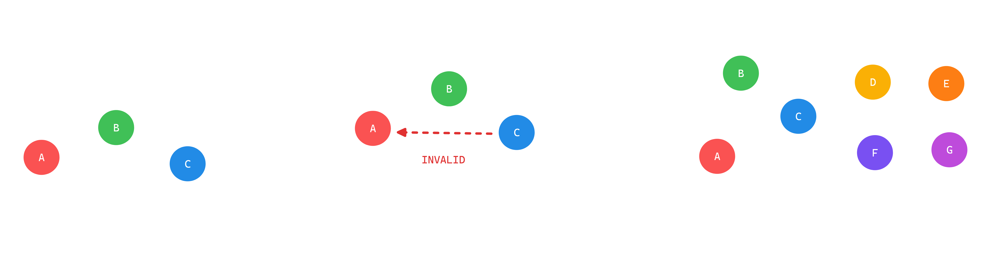
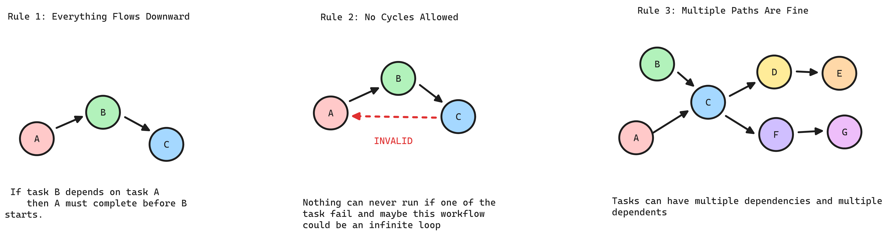

## Introduction

Every data pipeline you build is a DAG   whether you realize it or not. When you say "clean the data, then train the model, then evaluate" that's a DAG. When your ETL job waits for upstream tables before running   that's a DAG.

A **Directed Acyclic Graph** is simply:

- **Directed**: Tasks flow in one direction (A → B means A runs before B)
- **Acyclic**: No circular dependencies (A → B → C → A is forbidden)
- **Graph**: Nodes (tasks) connected by edges (dependencies)

Data engineering isn't just writing code; it's managing **causality**. If your feature engineering triggers before your cleaning script finishes, you aren't just getting an error   you're poisoning your model with garbage data.

#### Why Traditional Scheduling (Cron) is a Liability

Relying on "time-based" scheduling (e.g., Run A at 2:00, Run B at 2:15) is a gamble. It assumes your data volume never grows and your network never lags. When Task A inevitably takes 16 minutes instead of 15, your pipeline creates a **Race Condition**.

> **Real Talk:** Cron jobs are "fire and forget." DAGs are "aware." A DAG replaces hope with explicit logic.

#### The Operational Power of the DAG

By moving from random scripts to a formal DAG structure, you gain four critical production advantages:

1. **Deterministic Execution (Topological Ordering):** The orchestrator uses a topological sort to ensure that no task starts until its specific "contract" with its upstream parents is fulfilled. This guarantees that your API only serves models trained on the most recent, validated data.
    
2. **Resource Optimization (Parallelism):** In a linear script, Task B waits for Task A even if they have nothing to do with each other. A DAG identifies **independent branches**, allowing them to run simultaneously. This maximizes your cluster utilization and slashes your total "wall-clock" execution time.
    
3. **Resilience & Failure Isolation:** When a node fails in a DAG, the "blast radius" is contained. The orchestrator stops all **descendants** (to prevent corrupt data flow) but allows unrelated branches to finish.
    
    - **The Save:** You don't restart the whole pipeline; you fix the one failed node and resume from the point of failure.
4. **Lineage and Impact Analysis:** Because every edge is a recorded dependency, the DAG is your map for debugging. If a dashboard is "hallucinating" numbers, you don't guess   you trace the lineage upstream to the exact source or transformation node that caused the drift.
    

## 1. DAG Fundamentals

A DAG is a logical blueprint for a data pipeline. It is defined by a strict set of constraints that make complex dependencies manageable and data lineage traceable. Without these rules, you don't have a pipeline   you have a collection of scripts that might or might not work together.

### 1) Unidirectional Dependency (Directed)

If Task B depends on Task A, Task A **must** reach a "Success" state before Task B can initialize.

- **The Logic:** Information only flows from producer to consumer.
    
- **The Benefit:** This creates a strict **Data Lineage**. If a value is wrong in Task C, you can trace the error back through B to the exact source in A.
    
- **The Rule:** You cannot have "sideways" dependencies. Everything follows a clear, linear path of causality.
    

### 2) The Loop Constraint (Acyclic)

Cycles are a logic failure. If Task A needs Task B to finish, but Task B is waiting for Task A, the pipeline **deadlocks**.

- **The Reality:** Computers can't resolve infinite loops. If your graph has a cycle, your orchestrator (Airflow, Dagster, etc.) will simply refuse to parse the file.
    
- **The Requirement:** Every DAG must be resolvable into a **Topological Sort**   a linear list of instructions. No start-to-finish path can ever revisit the same node.
    

> **Topological** sort is the process of linearizing a DAG into a specific sequence where every parent node appears before its children. It is the logic an orchestrator uses to transform a complex web of dependencies into a clickable, step-by-step execution list.
> 
> **For rigorous math:** See [Topological Sorting on Wikipedia](https://en.wikipedia.org/wiki/Topological_sorting) and [DAG Theory](https://en.wikipedia.org/wiki/Directed_acyclic_graph) for formal definitions and algorithms. {: .prompt-info }

### 3) Convergent and Divergent Paths (Graph)

Real-world data isn't a straight line; it's messy. A DAG handles this through **Fan-out** and **Fan-in**.

- **Fan-out (One-to-Many):** A single "Ingest" task can trigger ten different "Validation" tasks in parallel.
    
- **Fan-in (Many-to-One):** A "Final Report" task can wait for five different upstream data sources to be ready before it runs.
    
- **The Result:** This structure allows for **Concurrency**. Tasks that don't depend on each other run at the same time, maximizing your cluster's resources and cutting down execution time.
    

{: .dark }

{: .light }

### Key DAG Vocabulary

When you move from the rules of a DAG to actually building one in Airflow or dbt, these are the terms that define your pipeline's behavior.

|**Term**|**Engineering Definition**|**Production Context**|
|---|---|---|
|**Node**|The atomic unit of work.|A SQL model, a Python script, or a sensor.|
|**Edge**|The directional dependency.|Defines the execution order; Task B cannot start until the edge from Task A is cleared.|
|**Source**|An entry point (In-degree = 0).|Where the data enters the system (e.g., S3, Kafka, or a Production DB).|
|**Sink**|A terminal point (Out-degree = 0).|The final destination, like a BI dashboard or an exported CSV.|
|**Upstream** (Parent/Ancestor)|The requirements.|If an **Ancestor** fails, the current node is "Upstream Failed" and won't run.|
|**Downstream** (Child/Descendant)|The impact zone.|If you change a schema in a parent node, these are the tasks you might break.|

---

## 2. DAGs in Causal Inference

In orchestration, a DAG defines **when** things run. In causal inference, it defines **why** things happen. If you don't map the causal DAG, you'll optimize for correlations that don't exist in production.

### Structural Causal Models (SCMs)

DAGs started as **Path Analysis** in the 1920s when geneticist Sewall Wright used arrows to track how traits literally flow from parents to offspring. Economists later added the **"Structural"** label, arguing these diagrams represent the underlying mechanics of a system   not just correlations. In the 1980s, Judea Pearl merged these ideas with computer science, providing the algorithmic rigor to turn causal diagrams into executable data structures.

An SCM defines the **generative process** of your data. It states that every variable is a deterministic function of its direct causes (parents) and an error term ($U$).

$$X = f(\text{Parents}, \text{Noise})$$

**The Production Reality:** If you are trying to predict "Customer Lifetime Value," you have to identify the root parents. If you miss a parent (like a global economic shift), your model's error term ($U$) blows up, and your predictions become useless.

---

### d-Separation: Controlling the Signal

In a complex graph, you need to know which variables are "independent" so you don't over-complicate your models. We use **d-separation** to identify when a path is blocked.

- **The Chain ($A \rightarrow B \rightarrow C$):** $B$ is a mediator. If you "condition" on $B$ (hold it constant), $A$ no longer provides any information about $C$.
    
    - _Practical use:_ Don't include redundant upstream features if the mid-point state is already captured.
- **The Fork ($A \leftarrow B \rightarrow C$):** $B$ is a common cause. This is the source of **spurious correlations**. $A$ and $C$ will look related, but they aren't.
    
    - _Practical use:_ You must include $B$ in your model to "de-bias" the relationship between $A$ and $C$.
- **The Collider ($A \rightarrow B \leftarrow C$):** This is the most dangerous. $A$ and $C$ are independent, but if you filter your data based on $B$ (the outcome), you create a **fake correlation** between $A$ and $C$.
    
    - _Practical use:_ Never filter your training set by a "post-treatment" variable, or you'll bake selection bias into your weights.

---

### Data Leakage: A Causal Violation

Leakage is simply a DAG where information flows from a **descendant** (future) back to an **ancestor** (past).

1. **Temporal Violation:** In a real-time system, a node at $T=10$ cannot influence a node at $T=5$.
    
2. **The DAG Defense:** By visualizing your feature engineering as a DAG, you can perform a "reachability" check. If there is a path from your **Target** (what you want to predict) back into your **Features**, your model is invalid.
    

> **Lineage is the audit trail.** If you can't trace a feature back to a source that existed _before_ the prediction timestamp, you have leakage.

---

## 3. Data Lineage

If the DAG is your pipeline's blueprint, lineage is its **flight recorder**. It provides a versioned, immutable record of how data state changes as it moves through the graph. In a high-stakes environment, lineage is the difference between "guessing" why a metric is wrong and "proving" exactly where the logic failed.

### The Three Perspectives of Traceability

To manage a complex system, we must be able to view the flow from three distinct angles:

- **Backward Lineage (Provenance):** Tracing a final output back to its raw source. This is the "Evidence Chain" used for **Root Cause Analysis** and regulatory compliance (e.g., GDPR Right to Explanation).
    
- **Forward Lineage (Impact):** Calculating the **Blast Radius**. It identifies every downstream descendant that will be affected if an upstream schema changes or a source file is corrupted.
    
- **Process Lineage (Transformation):** Capturing the "Black Box." This records the specific code version, transformation logic, and environmental metadata (e.g., Spark versions, Docker tags) used at the moment of execution.
    
### Precision through Granularity

Lineage is only as useful as its resolution. We categorize lineage by how "deep" into the data we can see:

1. **Coarse-Grained (Dataset Level):**

- Maps relationships between tables or files ( Table `A` -> Table `B` ).
- This is efficient for high-level orchestration and understanding general system dependencies.

2. **Fine-Grained (Column/Field Level):**

- Maps the specific flow of individual attributes ( `A`.user_id -> `B`.customer_key ).
- This is required for **Logic Debugging**   identifying exactly which transformation in a complex SQL join corrupted a specific metric.

3. **Record-Level Lineage:**

- The highest level of rigor, tracking individual rows.
- While computationally expensive, it is indispensable for auditing high-value financial transactions or individual healthcare records.

### The Semantic Translation Layer

In production, data rarely keeps the same name. Billing calls a user an `Account_ID`; Marketing calls them a `Lead_UUID`. Without a translation layer, a developer might incorrectly join these tables simply because they share a generic column name like `ID`.

**Semantic Mapping** solves this by using metadata to map these disparate **Physical Assets** to a single **Logical Entity** (e.g., "Unique Customer"). This prevents "Logical Hallucinations"   silent errors that pass every test but produce meaningless results.

### Operational Rigor: From Visibility to Action

In a mature architecture, lineage is not just for viewing; it is **executable**.

- **Automated Circuit Breaking:** If an upstream data quality check fails, a lineage-aware system uses **Reachability Logic** to automatically "kill" all downstream tasks before they can consume the poisoned data.
    
- **Lineage-Aware Testing:** Instead of running a full (and expensive) test suite for every minor change, you use the lineage graph to isolate the **Impact Zone**. You only re-run tests for the specific descendants of the node you modified.
    
- **Managing Schema Drift:** Lineage provides the history of **Schema Evolution**. If an upstream API changes a field from an `Integer` to a `String` (**Schema Drift**), the lineage record captures that version change, allowing you to replay historical data using the correct historical logic.
    

---

## 4. DAG Design Patterns and Anti-Patterns in Production

This section addresses what happens when those guarantees are violated in practice. 
Most pipeline failures are not infrastructure problems   ,they are **structural decisions** embedded in the DAG at design time. 

A poorly structured graph doesn't just fail; it fails in ways that are expensive to diagnose, impossible to partially recover, and difficult to refactor under load.

### 4.1 The Monolithic DAG

A single DAG that handles ingestion, transformation, validation, training, and serving in one graph.

- **Blast Radius Expansion:** A single failed node halts all downstream descendants. In a monolithic structure, an API failure in the ingestion layer blocks model training, report generation, and dashboard updates  even when those branches share no data dependency with the failed node.

<iframe width="560" height="315" src="https://www.youtube.com/watch?v=_aG9O00DG7o" title="YouTube video player" frameborder="0" allow="accelerometer; autoplay; clipboard-write; encrypted-media; gyroscope; picture-in-picture" allowfullscreen></iframe>

- **Backfill Cost:** Re-running a monolithic DAG means re-executing the entire graph. Selective replay of one domain's pipeline is not possible without dragging every other domain through the same execution cycle.

<iframe width="560" height="315" src="https://www.youtube.com/watch?v=FVvm1QDWtmM
" title="YouTube video player" frameborder="0" allow="accelerometer; autoplay; clipboard-write; encrypted-media; gyroscope; picture-in-picture" allowfullscreen></iframe>

- **Scheduler Overhead:** The orchestrator parses every DAG file on each heartbeat cycle. A single DAG with hundreds of tasks creates a parsing bottleneck that degrades scheduling performance across the entire system.

<iframe width="560" height="315" src="https://www.youtube.com/watch?v=1GVw-UgZbFA
" title="YouTube video player" frameborder="0" allow="accelerometer; autoplay; clipboard-write; encrypted-media; gyroscope; picture-in-picture" allowfullscreen></iframe>

**Resolution Domain-Bounded DAGs:** Decompose the monolithic graph into smaller DAGs organized by **business domain** or **data product**. An ingestion DAG writes to a staging layer. A transformation DAG reads from staging and writes to the warehouse. A serving DAG handles final aggregation. 

Each DAG owns one responsibility, runs on its own schedule, and fails independently. Coordinate between them using **sensors** or **event-driven triggers** rather than embedding them in a single graph.

### 4.2 Implicit Dependencies

A relationship between two nodes (or two DAGs) that exists in reality but is not declared as an edge in the graph.

This occurs when DAG B reads from a table that DAG A writes to, but no dependency is declared between them. The team relies on schedule timing    "A runs at 2:00, B runs at 2:30." This is the same time-based assumption from the introduction, repackaged inside an orchestrator.

When A exceeds its expected runtime, B reads stale or partially written data. The orchestrator reports both DAGs as successful. The corruption propagates downstream until a consumer notices inconsistent numbers days later.

- **The Requirement:** Every real data dependency must be an **explicit edge** in the graph    modeled as a sensor, a dataset-triggered dependency, or an inter-DAG event. If the dependency is not in the graph, the lineage trace from Section 3 becomes unreliable.

### 4.3 Non-Idempotent Tasks

An **idempotent** task produces the same result whether it is executed once or multiple times with the same inputs. This property is what makes retries safe and backfills predictable.

The common violation is a task that **appends** to a table instead of **overwriting** a partition. First execution: 1,000 rows. Retry after a transient failure: 2,000 rows. Backfill across three dates: data duplicated in some partitions, correct in others. The downstream aggregation appears plausible but produces incorrect results.

Other violations include:

- Tasks that trigger external side effects (notifications, API calls) on every execution without deduplication.
- Tasks that generate timestamps or identifiers at runtime instead of deriving them deterministically from the execution context.
- Tasks that mutate shared state without a clean reset mechanism.

**The Rule:** Every task should produce the same output when re-run with the same inputs, with no accumulated side effects. In practice: write to **partitioned targets** using the logical execution date as the partition key, and use **overwrite semantics** (`INSERT OVERWRITE`, `CREATE OR REPLACE`) instead of append operations.

### 4.4 Silent Failures

A pipeline that completes without error is not necessarily a pipeline that produced correct data. Tasks that succeed technically but produce invalid output are the most difficult failures to detect    nothing in the system raises an alarm.

- An upstream API returns an empty response due to a rate limit. The ingestion task writes an empty file and exits successfully. Every downstream node processes the empty dataset. The dashboard displays zeroes. No alert fires.
- A schema change in a source system renames a column. The transformation query silently drops the column. The resulting table contains NULL values where valid data should exist.

**Resolution    Staged Quality Gates:** Insert **validation nodes** between pipeline stages. These nodes assert properties about the data before allowing downstream execution to proceed:

- **Row count checks:** Is the record count within an expected range compared to the previous run?
- **Schema validation:** Does the output match the expected column names and types?
- **Freshness checks:** Is the source data from the current execution window?
- **Business logic assertions:** Are there values that violate known domain constraints (negative revenue, orphaned foreign keys)?

When a validation node fails, the orchestrator applies the **circuit-breaking** behavior from Section 3    halting all descendants using reachability logic. This converts silent corruption into an explicit, traceable failure with a clear point of origin.

### 4.5 Hardcoded Configuration

Embedding environment-specific values directly in DAG definitions    connection strings, storage paths, credentials, schedule intervals    creates a pipeline that functions in development and fails unpredictably in production.

The failure is often subtle: a DAG is cloned for a new environment, one path is not updated, and the production pipeline begins writing to a development database. Or a credential rotates and the pipeline fails because the secret was embedded in the task definition.

**Resolution:** Externalize all configuration. Connection details reside in the orchestrator's connection manager or a secrets vault. Storage paths, table names, and environment identifiers are injected through **variables** or **templating**. The DAG definition should be **environment-agnostic**: the same code deploys to development, staging, and production with no modifications.

### 4.6 Schema-Unaware Pipelines

Upstream systems change. Columns are renamed, data types shift, new fields appear, old fields are removed. A pipeline that assumes a static source schema will break    or produce corrupted outputs silently.

This connects directly to the **Schema Drift** concept from Section 3. The anti-pattern is assuming stability. The pattern is designing for change:

- **Contract Testing:** Define an explicit schema contract for every source. Before ingestion, validate incoming data against the contract. If a field is missing or a type has changed, fail the task immediately.
- **Schema Evolution Tracking:** Use the lineage system to record schema versions over time. When drift is detected, the historical record identifies exactly when the change occurred and which downstream assets were affected.
- **Defensive Transformations:** Use explicit column selection (`SELECT col_a, col_b`) instead of wildcards (`SELECT *`). A new column in the source should not silently alter the output schema.
